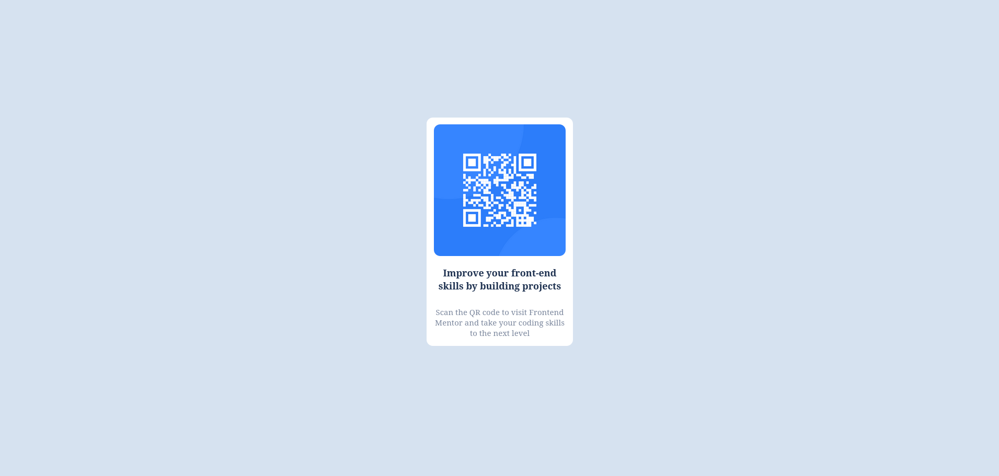

# Frontend Mentor - QR code component solution

This is a solution to the [QR code component challenge on Frontend Mentor](https://www.frontendmentor.io/challenges/qr-code-component-iux_sIO_H). Frontend Mentor challenges help you improve your coding skills by building realistic projects. 

## Table of contents

- [Overview](#overview)
  - [Screenshot](#screenshot)
  - [Links](#links)
- [My process](#my-process)
  - [Built with](#built-with)
  - [What I learned](#what-i-learned)
- [Author](#author)

## Overview

Please, this is my first frontend project. I'd love to have any feedback of it. You may send me any email to noethercode@gmail.com. Many thanks!
### Screenshot

### Links

- URL with the code (Netlify): [url](https://phenomenal-monstera-077701.netlify.app/)

## My process

1. I tried to get the layout first, which was a pain because it's the first time I've done it. Decided to use flexbox
2. Once I got it, then made sure the colors and fonts where correctly done and rendered
3. Then I had to adjust margins, padding and font size. Everything is done in px so it's terribly not responsive
### Built with

- HTML5
- CSS3
- Flexbox

### What I learned

I learned how to make a basic component. It's still terrible, so I'd absolutely love any feedback on how to do it better

## Author

- Frontend Mentor - [@starseeker-code](https://www.frontendmentor.io/profile/starseeker-code)
